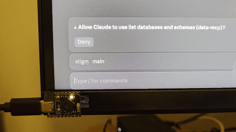

# Claude Buddy Lite

A minimal hardware companion for Claude Code, running on an **ESP32-S3 SuperMini**.
It mirrors the state of your Claude Code session on the onboard WS2812 RGB LED and
lets you approve or deny permission prompts with two physical buttons — over BLE,
no extra hardware required.



It speaks the [Hardware Buddy BLE protocol](https://github.com/anthropics/claude-desktop-buddy/blob/main/REFERENCE.md)
and pairs with the [claude-desktop-buddy](https://github.com/anthropics/claude-desktop-buddy)
desktop bridge.

## What it does

- **LED state** — the onboard LED reflects whether Claude is idle, running a tool,
  or waiting on you for a permission prompt.
- **Buttons** — one approve, one deny. When Claude is waiting on a permission
  prompt, pressing the approve or deny button responds to it instantly.

### LED legend

| State | Animation | Meaning |
|-------|-----------|---------|
| Advertising | Slow dim blue pulse | No desktop paired yet |
| Idle (paired) | Steady dim white | Connected, no active turn |
| Running | Slow blue/green pulse | Claude is working |
| Waiting | Fast pulse, green → red | Permission prompt pending — hue reflects the [command danger score](#command-danger-score) |

If the desktop heartbeat stops for more than 30 s, the LED falls back to idle.

### Command danger score

When Claude is waiting on a permission prompt for a Bash command, the LED
hue is driven by a 1–5 danger score so you can decide whether to approve
before reading the screen. The prompt's `hint` field (a truncated preview
of the command) is matched against a keyword table of ~750 entries; the
highest matching score wins, and unknown commands default to **3** so an
unrecognized prompt leans cautious instead of safe-green.

| Score | Hue | Meaning | Examples |
|------:|-----|---------|----------|
| **1** | Green | Read-only / inspect | `ls`, `cat`, `tree`, `grep`, `git status`, `kubectl get`, `jq`, `aws ec2 describe` |
| **2** | Yellow-green | Runs code locally | `python`, `node`, `pytest`, `go test`, `npm run`, `bash` |
| **3** | Yellow | Writes locally, contained | `cp`, `mkdir`, `git commit`, `npm install`, `docker pull`, `sed -i`, `ssh-keygen` |
| **4** | Orange | Mutates system / remote state | `sudo`, `chmod`, `mv`, `git push`, `kubectl apply`, `docker rm -f`, `aws ec2 stop-instances`, `gh pr merge` |
| **5** | Red | Destructive / irreversible | `rm -rf`, `git push --force`, `git filter-repo`, `kubectl delete`, `terraform destroy`, `aws s3 rm`, `gh repo delete`, `rsync --delete`, `prisma migrate reset` |

The matcher lives in
[`commands_score.h`](esp32s3-supermini-led-buddy/commands_score.h); the
~750-entry keyword table lives in
[`commands_table.h`](esp32s3-supermini-led-buddy/commands_table.h). Matching
is case-insensitive and word-boundary aware, so multi-token entries like
`"git push --force"` land naturally while bare `"rm"` doesn't catch
`"warm"`. The loop runs highest-score-first, short-circuits past any entry
that can't beat the current best, and exits as soon as a 5 hits — so even
the full table scores in well under a millisecond on the S3.

To re-tune for your own threat model — say, demoting `git push` from 4 to
3, or promoting `terraform apply` to 5 — edit the corresponding entry in
`commands_table.h` and reflash.

## Hardware

- **MCU:** ESP32-S3 SuperMini (any pin-compatible variant works)
- **LED:** onboard WS2812 on GPIO48 (already wired on the SuperMini)
- **Buttons:** 2× momentary push buttons, plus a recessed reject button if you
  want to keep it on the desk

### Pinout

| Pin   | Purpose | Decision sent |
|-------|---------|---------------|
| GP13  | Approve | `"once"` |
| GP12  | Deny    | `"deny"` |

### Wiring

Each button is wired between the GPIO pin and **GND**. The firmware enables the
ESP32's internal pullup, so no external resistors are required.

```
   GP13 ─────┐    (or GP12 for deny)
             │
            ─┴─   (momentary switch)
             │
   GND  ─────┘
```

When the button is open, the internal pullup holds the pin HIGH.
Pressing the button shorts it to GND (LOW); the firmware debounces (30 ms) and
fires the permission response on the falling edge.

### Foot pedal recommendation (for the approve button)

In a real session, "approve" is by far the most frequent action — every Bash
invocation, every file edit, every tool use that isn't on your auto-allow list
is a tap. A small tactile button on the desk gets old very quickly, and
reaching for the keyboard defeats the point of having a hardware buddy.

**Use a momentary foot pedal for the approve button.** Most cheap
"transcription" or "studio" foot switches are just a SPST momentary switch with
a 1/4" or 3.5 mm jack. Cut the cable, identify the two contacts with a
multimeter, and wire one contact to **GP13** and the other to **GND**. The
internal pullup handles the rest. (Off-the-shelf foot pedals are already wired
as switch-to-ground, so this matches the convention — see the wiring note
above for why that matters on a long cable.)

Recommended setup:

- **Foot pedal → GP13 (approve)** — keep both hands on the keyboard while you
  read what Claude wants to do, then stomp to approve.
- **Tactile button on the desk → GP12 (deny)** — deny is a deliberate
  "actually, no" action; a button you have to look at is a feature.

You can swap the pin assignments by flipping the entries in `gButtons[]` in the
sketch if you'd rather have the foot pedal deny instead.

## Build & flash

1. Install the **Arduino IDE** (2.x) and add the **Espressif ESP32 Arduino core
   v3.x or later** via the board manager.
2. Install these libraries via Library Manager:
   - **FastLED**
   - **NimBLE-Arduino**
   - **ArduinoJson** (v7)
3. Open `esp32s3-supermini-led-buddy/esp32s3-supermini-led-buddy.ino`.
4. Board settings:
   - Board: **ESP32S3 Dev Module**
   - USB CDC On Boot: **Enabled**
   - Upload speed: **921600**
5. Plug in the SuperMini, pick the serial port, and hit Upload.

On boot the device advertises as **`Claude-Buddy-Lite-XXXXX`**, where the
5-char suffix is the last three bytes of the BT MAC encoded as Crockford
base32 (so two Buddies in the same room don't clash in the picker, and the
suffix has no `I`/`L`/`O`/`U` ambiguity). The LED will start its slow dim
blue pulse. Next, pair it with Claude Desktop (below).

## Enable Hardware Buddy in Claude Desktop

Hardware Buddy support is built into the **Claude Desktop** app (macOS and
Windows), but lives behind the developer menu. It is *not* part of the
`claude` CLI.

1. Open **Claude Desktop**.
2. **Help → Troubleshooting → Enable Developer Mode.**
3. **Developer → Hardware Buddy → Connect.**
4. In the picker, select your device — it appears as
   **`Claude-Buddy-Lite-XXXXX`** (the 5-char suffix is the last three bytes
   of its BT MAC in Crockford base32, also printed to the USB serial console
   at boot).
5. If macOS prompts for Bluetooth permission, allow it.

When the connection succeeds the LED switches from the dim blue pulse to a
steady dim white, and the Hardware Buddy window in Claude Desktop will start
showing live session stats. You can disconnect from the same window; to wipe
the stored bond entirely, use the **Unpair** action there (the desktop sends
`{"cmd":"unpair"}` and the device clears its bond table).

> **Pairing PIN note.** Anthropic's reference build (M5StickCPlus) shows a
> 6-digit pairing code on its LCD. The SuperMini has no display, so this
> firmware uses NimBLE's default "Just Works" pairing — there is no PIN to
> enter. For a deployment outside your own desk, add a passkey to `setupBLE()`
> via `NimBLEDevice::setSecurityAuth(...)` / `setPasskey(...)`.

## Protocol summary

- **Service UUID:** `6e400001-b5a3-f393-e0a9-e50e24dcca9e` (Nordic UART Service)
- Desktop sends newline-delimited JSON heartbeat snapshots; the device tracks
  `running`, `waiting`, and the active `prompt.id`.
- On a button press the device emits:
  ```json
  {"cmd":"permission","id":"<promptId>","decision":"once"}
  ```
  or `"deny"`. Presses with no active prompt are ignored.

Full spec: [claude-desktop-buddy/REFERENCE.md](https://github.com/anthropics/claude-desktop-buddy/blob/main/REFERENCE.md).

## License

See [LICENSE](LICENSE) (if present) or treat as MIT.
